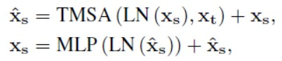
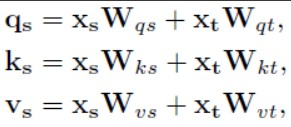

# DiffiT-Implementation

Here we have provided a Pytorch Lightning re-implementation of the paper **"DiffiT: Diffusion Vision Transformers for Image Generation"**. The paper proposes two different architectures: the **Image Space** architecture, which is basically a U-shaped encoder-decoder architecture, and the **Latent Space** architecture, which is another encoder-decoder architecture that makes use of a vision transformer in the middle.

The paper focuses on two main issues:
* There was no standard design pattern for using self-attention layers in denoising networks;
* There was the need for better control in capturing the time-dependence aspect in self-attention modules for denoising diffusion models.

In order to address these challenges, the paper introduces a new model called **DiffiT**: this model aims at integrating the temporal dependency into self-attention layers, and it has shown to outperform other models in tasks related to image generation. For further information, please refer to the original paper itself.

---
## Core block

The core block of the DiffiT model is the **DiffiT Transformer Block**, which is defined as follows:

At every layer, the DiffiT Transformer block receives a set of tokens {$\mathbf{x}_s$} arranged spatially on a 2D grid; it also receives $\mathbf{x}_t$, a time token representing the time step. The time token is obtained by feeding positional time embeddings to a small MLP with Swish activation function.

At this point, the authors define their **Time-Dependent Multi-Head Self-Attention (TMSA)** layer, that captures both long-rande spatial and temporal dependencies by projecting feature and time token embeddings into a shared space. In particular, time dependent queries **q**, keys **k** and values **v** in the shared space are computed by a linear projection of spatial and time embeddings:

As a result, queries, keys and values are all linear functions of both time and spatial tokens, and they can adaptively modify the behavior of the attention mechanism for different time steps.

The Self-Attention is computed as follows:

where **Q = $\mathbf{q}_s$**, **K = $\mathbf{k}_s$** and **V = $\mathbf{v}_s$** are a stacked form of queries, keys and values in rows of a matrix; **d** is a scaling factor for keys K, and **B** corresponds to a *relative position bias*, which allows for the encoding of the information across each attention head.

---
## Image Space DiffiT Architecture

The **Image Space DiffiT Architecture** consists of a symmetrical U-shaped encoder-decoder architecture in which the contracting and expanding paths are connected to each other via skip connections at every resolution.

In particular, each resolution consists of L consecutive DiffiT blocks, containing the time-dependent self-attention modules proposed by the paper. At the beginning of each path, a convolutional layer is employed, in order to match the number of feature maps. In addition, a convolutional *upsampling* or *downsampling* layer is also used for transitioning between each resolution.

In the Image Space DiffiT Architecture, a **DiffiT ResBlock** is also defined by combining the proposed DiffiT Transformer block with a convolutional layer, by means of a residual connection:

---
## Latent Space DiffiT Architecture

In the **Latent Space DiffiT Architecture**, the images are first of all encoded by the means of a variational autoencoder network; although in the paper is used a pre-trained network, here we have re-implemented it from scratch as requested.

The produced feature maps are then converted into non-overlapping patches, and projected into a new embedding space. Then, a Vision Transformer is used as the denoising network in the latent space, without upsampling or downsampling layers. the final layer of the architecture is a simple linear layer for decoding the output.

---
# How to run the code

The repository provides two different (but in fact equivalent) notebooks: the *DiffiT_Image_Space_Architecture.ipynb* is ready to run the Image Space DiffiT model, and the *DiffiT_Latent_Space_Architecture.ipynb* is ready to run the Latent Space DiffiT model. In practice, once you have chosen the notebook, you can simply run all the cells.

The initial configuration of both the notebooks is intended to run on Google Colaboratory; therefore, the runtime connects to Google Drive for automatically saving your weights in case of training. Be aware: if you automatically run all the cells, the notebook will try to connect to your drive, and therefore it will ask you for permission.

The initial configuration is intended to run the training, the testing and the evaluation of the metrics phases. If you want to change this, you can modify accordingly the boolean variables IS_TRAIN, IS_TEST and/or IS_METRIC. Once these variables have been set, you can simply run all the cells of the notebook. Be aware of two things:
* Run the notebook using the GPU;
* The test phase and the evaluation metric phase require previously saved weights: therefore, be sure to have set IS_TRAIN=True or to have previosly saved weights in the path specified in the PATH_WEIGHTS variable.

*Note*: If you want to test our models as described in the notebooks, or if you want to simply have pre-trained models as a starting point for further experiments, here are our best ones:
* Latent Space: [link](https://drive.google.com/file/d/1i7zMGkwB2XN0D_7wkzAPEkTw9Xhr_fsl/view?usp=drive_link)
* Image Space: [link](https://drive.google.com/file/d/1Iz5bXPs74OnOO0XBSgjNmu2fYUmKLeJf/view?usp=drive_link)

The notebooks are intended to load weights from Google Drive; therefore, we suggest to download the weights from our links, to load them on your own drive (i.e. on the MyDrive folder) and to modify the DIR_WEIGHTS and PATH_WEIGHTS variables accordingly.
